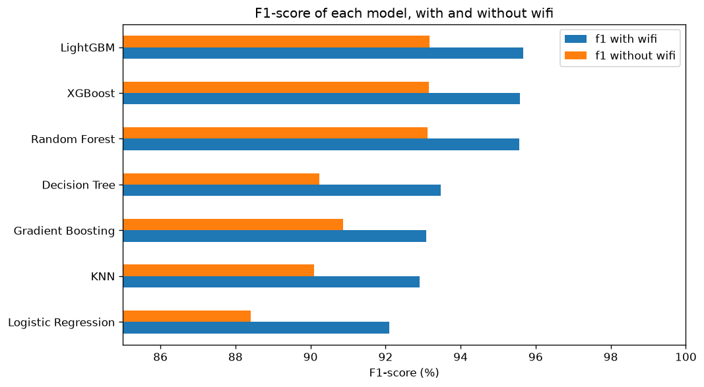
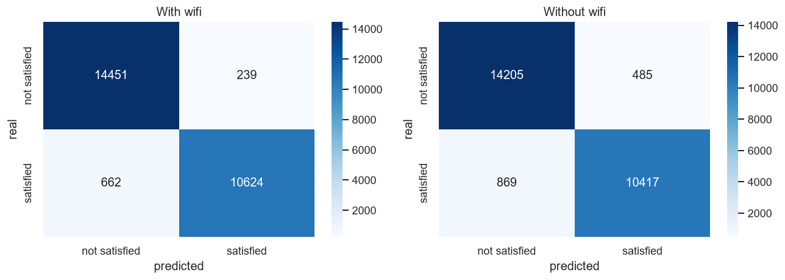
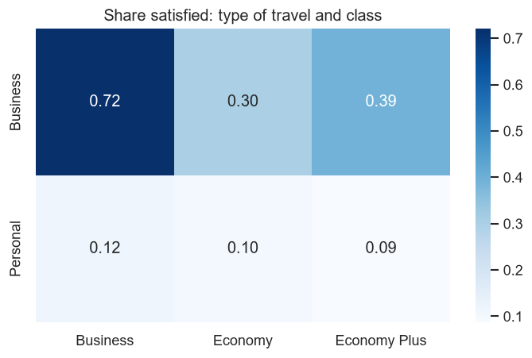
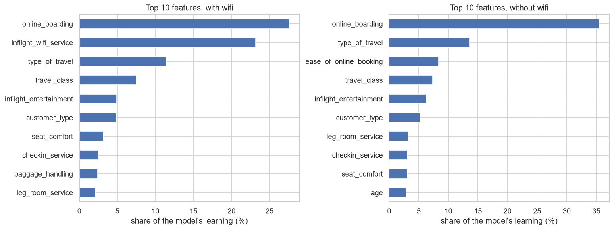

# Airline Passenger Satisfaction Predictor

A machine learning project that estimates whether an airline passenger was satisfied, using their trip details and service ratings. The data lives in PostgreSQL, the final model is a tuned LightGBM, and a Streamlit app lets anyone try it.

**Live app:** https://airline-satisfaction-ml-w9cpe5rwe6acpz7vqrkduf.streamlit.app/

## The question

Which parts of the flying experience go with a satisfied passenger, and how well can satisfaction be estimated from them?

## The data

129,880 survey responses from airline passengers [Kaggle](https://www.kaggle.com/datasets/teejmahal20/airline-passenger-satisfaction). Each row has the passenger's customer type, type of travel, class, age, flight distance, delays, 14 service ratings from 0 to 5, and whether they were satisfied. 43.4% were satisfied, so always guessing "not satisfied" would be right 56.6% of the time.

## What I did

1. Loaded the CSV into PostgreSQL and read it into Python from there.
2. Checked the data quality: no duplicates, 393 blank arrival delays, and a rating of 0 that means "not applicable".
3. Explored it with 20 charts.
4. Locked 20% of the passengers away as a test set, and tested every column decision on the other 80% only. Four columns were dropped at almost no cost, and seven new columns I built were rejected because none of them helped.
5. Compared seven algorithms with 5-fold cross-validation, tuned the best three with randomized search, and chose LightGBM.
6. Scored the final models once, on 25,976 passengers they had never seen.
7. Built a Streamlit app.

## Results

Scores on the 25,976 held-out passengers:

| | With the wifi rating | Without the wifi rating |
|---|---|---|
| Accuracy | 96.5% | 94.8% |
| F1-score | 95.9 | 93.9 |
| ROC-AUC | 99.5 | 98.7 |

Cross-validation on the training rows predicted these scores to within 0.4 points, and the gap between training and test accuracy is under 0.4 points, so the model is not overfitting.





## What I found

- **Online boarding is the rating that matters most.** It had the strongest link to satisfaction, and the final model gets 28% to 35% of its learning from it.
- **Trip type and class matter even more as a pair.** 58% of business travellers were satisfied against 10% of personal travellers, and 69% of Business class passengers against 19% in Economy. Personal travellers were unhappy in every class.
- **Age follows a hump, not a line.** Satisfaction rises to a peak of 58% at ages 46 to 55, then falls to 18% for over-65s.
- **Delays matter less than expected.** About 46% of on-time passengers were satisfied, against 36% to 38% for passengers delayed by more than 15 minutes.
- **The wifi rating looks odd.** Passengers who rated it 0 or 5 were about 99% satisfied, far above any other rating. That looks like a quirk of how the data was made, not real behaviour. The model that uses wifi is 1.7 points more accurate, but about 23% of its learning comes from that single rating. So the app uses the no-wifi model by default, with wifi as an opt-in switch.





## Limits

- The ratings and the satisfaction answer come from the same survey. The model shows what goes with satisfaction. It does not forecast how someone will feel in advance.
- It describes one dataset. It may not carry over to other airlines.
- "What the model uses" is not the same as "what causes satisfaction".

## Try it yourself

The app needs only `requirements.txt`, and no database:

```
git clone https://github.com/Siddharthkeshwani/airline-satisfaction-ml.git
cd airline-satisfaction-ml
python -m venv venv
venv\Scripts\activate
pip install -r requirements.txt
streamlit run app/app.py
```

To repeat the training, you also need PostgreSQL, the dataset in `data/raw/`, a `.env` file (copy `.env.example`), and `requirements-dev.txt`. Then run the notebooks in order.

## Project structure

```
app/          the Streamlit app
models/       the saved models, their settings and a record of how they were made
notebooks/    01 database, 02 exploration, 03 features, 04 split, 05 models, 06 tuning and evaluation, 07 load test
reports/      result tables and charts
sql/          the SQL used to create and load the PostgreSQL table
src/          reusable code (database connection, column lists, features)
```

## Tools

Python, PostgreSQL, pandas, scikit-learn, LightGBM, XGBoost, Streamlit.